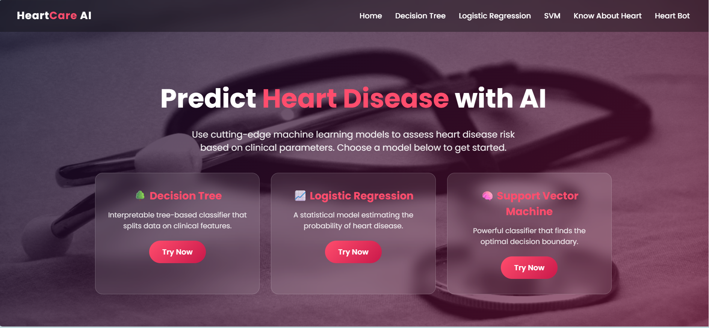
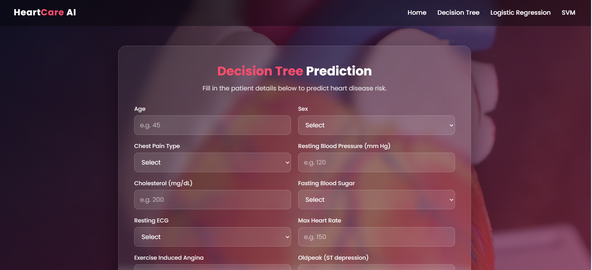
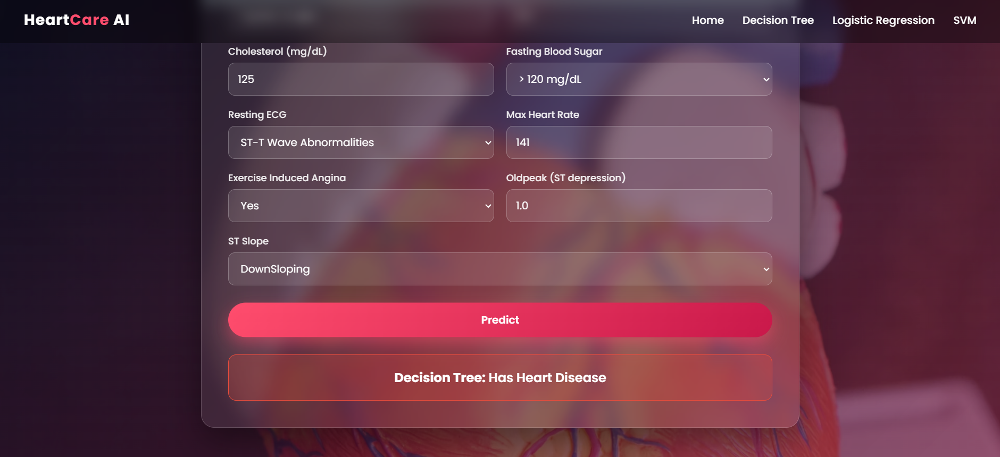
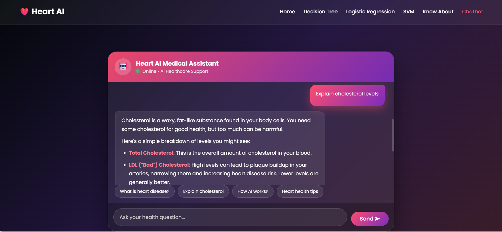
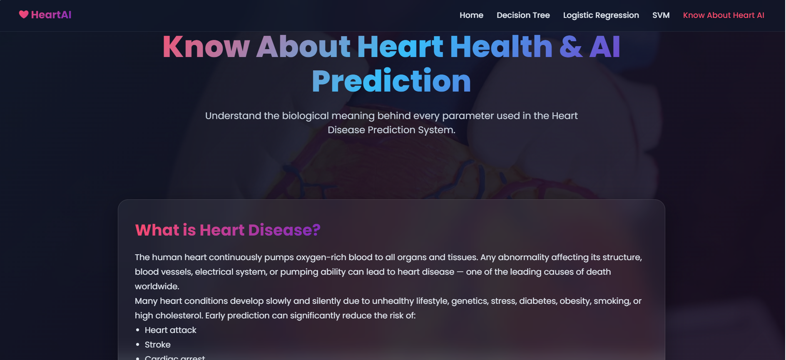

# HeartCare AI: Heart Disease Prediction System

HeartCare AI is a specialized web application that leverages machine learning to predict the likelihood of heart disease based on clinical patient data. The system provides three distinct predictive models and an interactive assistant, allowing users to compare results and get instant answers to health-related queries.

## 📱 Application Preview

### 1. Landing Page
The home interface introduces the HeartCare AI system and provides quick access to the prediction models and the educational dashboard.
> **Screenshot Link:** 

### 2. ML Prediction Interfaces
Each model (Decision Tree, Logistic Regression, and SVM) features a dedicated form where users can input patient metrics like Age, Cholesterol, and Max Heart Rate to receive instant risk assessments.
> **Screenshot Link:** 
> **Screenshot Link:** 

### 3. Interactive AI Chatbot
The system includes an AI-powered chatbot designed to answer user questions about heart health, interpret clinical terms, and provide guidance on using the application.
> **Screenshot Link:** 

### 4. Educational Dashboard (Know Your Heart)
This section explains the biological significance of the 11 clinical parameters used in the models, such as "Oldpeak" (ST depression) and "ST Slope".
> **Screenshot Link:** 

---

## 🛠️ Technology Stack

* **Backend:** Python 3.12+ using the Flask 3.0.3 framework.
* **Machine Learning:** Scikit-learn 1.5.1, Pandas 2.2.2, and NumPy 1.26.4 for data processing and model inference.
* **Frontend:** HTML5, CSS3 with modern glassmorphism effects, and JavaScript using the Fetch API.
* **Production:** Gunicorn 22.0.0 for web server management.

---

## ⚙️ Features

* **Multi-Model Analysis:** Choice of Decision Tree, Logistic Regression, or Support Vector Machine (SVM) models.
* **Real-time Processing:** Data is preprocessed and fed into specialized `.pkl` models to return predictions immediately.
* **AI Assistant:** A built-in chatbot for interactive health information and support.
* **Informative UI:** Detailed descriptions for every medical parameter, such as Resting ECG and Exercise-Induced Angina.
* **Responsive Design:** Optimized layout for both desktop and mobile viewing via `style.css`.

---

## 🚀 Installation & Local Setup

1.  **Clone the repository:**
    ```bash
    git clone <your-repository-link>
    cd Heart_Disease_Predictor_Web_App
    ```

2.  **Create a virtual environment:**
    ```bash
    python -m venv venv
    source venv/bin/activate  # On Windows: venv\Scripts\activate
    ```

3.  **Install dependencies:**
    ```bash
    pip install -r requirements.txt
    ```

4.  **Run the application:**
    ```bash
    python app.py
    ```
    Access the app at `http://127.0.0.1:5000/`.

---

## 📝 Medical Disclaimer
This tool is for **educational and research purposes only**. It is not a substitute for professional medical advice, diagnosis, or treatment. Always seek the advice of your physician or other qualified health provider with any questions you may have regarding a medical condition.

---
© 2026 HeartCare AI — Educational AI Healthcare Project
